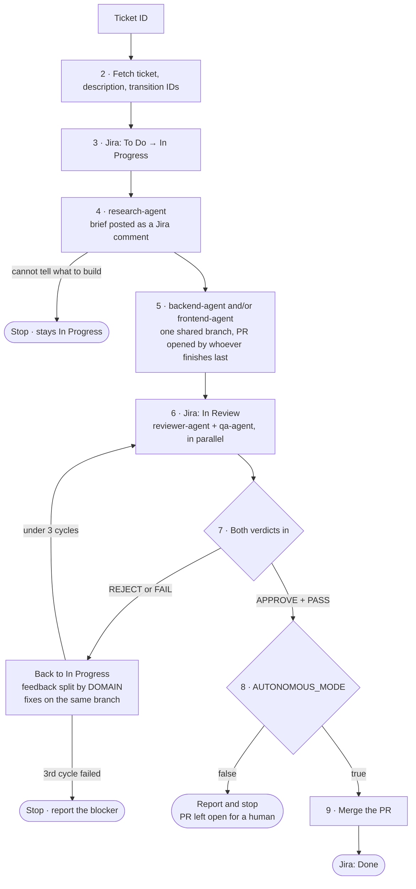
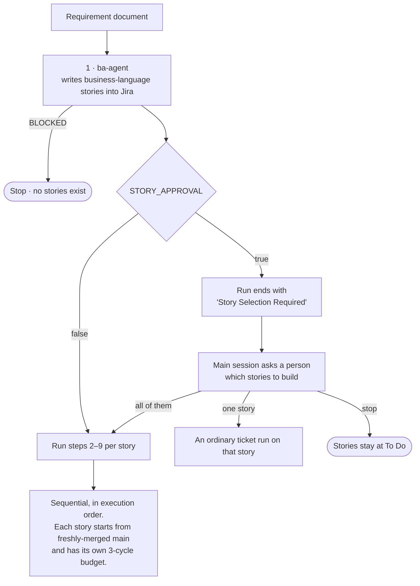
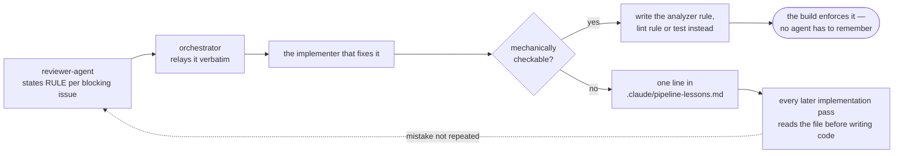
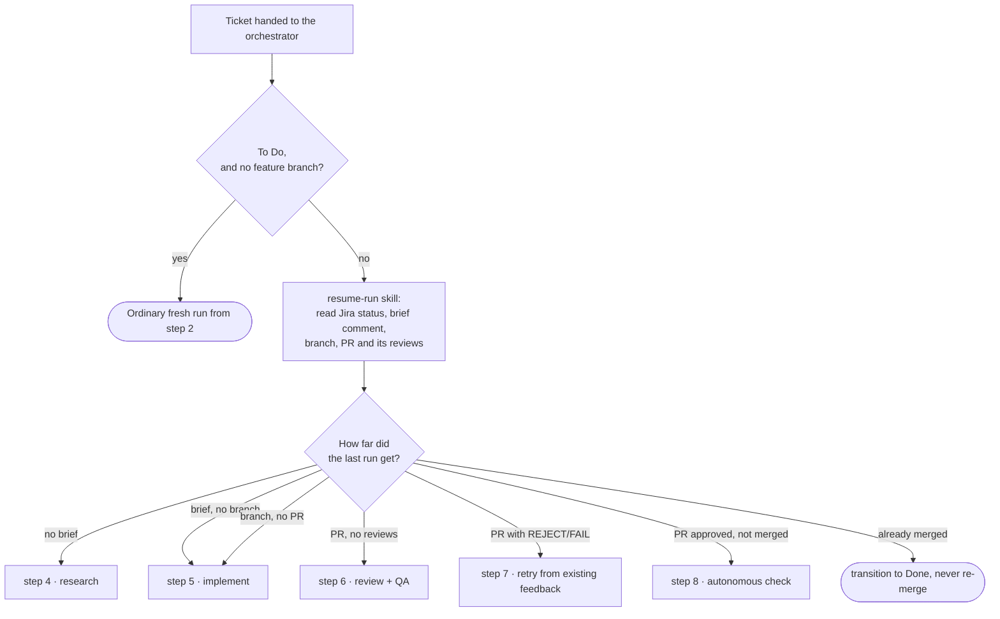

# claude-pipeline-kit

A fleet of Claude Code subagents that takes a Jira ticket — or a whole
requirement document — from intake to a merge-ready PR.

A run researches the ticket against your codebase, implements it, opens a PR,
then gates that PR behind an independent code review and a QA pass that runs
your real test suite. Each stage acts as its own bot account, so the Jira
history and the GitHub review trail show who decided what.

## Install

```bash
claude plugin marketplace add shanilmelder/claude-pipeline-kit
claude plugin install claude-pipeline-kit@claude-pipeline-kit
```

Install prompts for five GitHub bot tokens and stores them as secrets. Running
everything as one account instead? Set `ACCOUNT_SEPARATION: false` (see
below) and paste the same token into all five prompts. Pin a
release with `claude plugin marketplace add shanilmelder/claude-pipeline-kit@v1.0`
— agent prompts are behaviour, and you probably don't want them changing
under a running team.

Then, in the project you want the pipeline to work on:

```
/pipeline-init
```

That writes `.claude/pipeline.config.md` — your Jira project key, bot account
names, tech stack, and whether runs merge autonomously. Commit it.

Before the first run, work through `docs/PIPELINE-SETUP.md` for the parts no
installer can do: creating the bot accounts, authenticating each Jira alias
while logged in as the right bot, and branch protection.

## Use

```
/run-pipeline PROJ-123                      # one ticket
/run-pipeline docs/requirements/checkout.md # split a document into stories, then build them
```

With `STORY_APPROVAL: true`, a document run stops after the stories are
created and asks which to build — all of them, one, or none.

`python3 dashboard/server.py` shows runs live.

## How a run flows

### A ticket run

The nine steps in `PIPELINE.md`, as the orchestrator walks them. Rounded nodes
are where a run ends. Every one of them except the merge leaves the ticket
where it died rather than forcing a status that isn't true, so a follow-up run
can pick it up from there.



Review and QA run as one parallel gate on purpose: serialising them produces a
fix-review-fix-QA ladder where each round surfaces only one class of problem.
A retry pass returns to step 6, so the re-review sees only the incremental
diff since the previous head SHA.

### A requirements-document run



Stories never run in parallel even when marked independent — they share one
repo and one main branch, and a second story branched before the first merged
is a rebase somebody has to babysit. A story that hits its retry cap stops
only itself; the run continues with the next, unless that one `DEPENDS_ON` it.

## What's in it

Seven agents (`ba`, `research`, `backend`, `frontend`, `reviewer`, `qa`,
`orchestrator`), two skills (`run-tests`, `resume-run`), two commands, and
nine MCP server definitions. `PIPELINE.md` is the specification the
orchestrator follows; read it if you want to know exactly what a run does.

### Learning across tickets

Implementers repeat mistakes because a review finding is used once and thrown
away. So `reviewer-agent` states the general **rule** behind each blocking
issue, and the agent that fixes it records that rule in
`.claude/pipeline-lessons.md` — which every later implementation pass reads
before writing code.

The file is capped at ~20 rules, and rules are meant to *leave* it: when one
is mechanically checkable, the implementer writes the analyzer rule, lint
rule or test instead, and the build enforces it with no agent having to
remember. A lessons file that only grows is a sign the project needs a
written conventions doc, not more memory.



Read it now and then. A wrong rule in there gets followed forever.

### Resuming a stopped run

A run that stopped — retry cap, ambiguous ticket, interrupted session — leaves
its state on Jira and GitHub, and that state *is* the checkpoint. Handing the
same ticket back to the orchestrator resumes it rather than starting over, so
research already written on the ticket is not paid for twice.



The retry count carries forward rather than resetting, so a story that already
burned its three cycles does not quietly start a fourth.

### One account or several

`ACCOUNT_SEPARATION` in `.claude/pipeline.config.md` decides whether the
pipeline runs as five GitHub bots and four Jira bots, or as a single account
wearing every hat.

Separated is the default and the stronger setup: a different account approves
the PR than opened it, so branch protection can make the review gate binding.
Single-account is far quicker to set up and runs the identical pipeline —
same research, same review, same tests — with one difference GitHub imposes:
an account cannot approve, request changes on, or be requested as a reviewer
on its own PR. So no reviewers are attached to the PR, and reviewer-agent and
qa-agent post their findings as `COMMENT` reviews instead. Their verdicts
still gate the merge; they just gate it through the orchestrator rather than
through GitHub.

Pairing `ACCOUNT_SEPARATION: false` with `AUTONOMOUS_MODE: true` removes the
last independent check on a merge. Do it deliberately or not at all.

### Models

Each agent pins a model in its frontmatter: **Opus** everywhere except
`qa-agent`, which runs on **Sonnet**. The principle is to cheapen execution
before cheapening a gate — with a 3-cycle retry cap, a reviewer that misses a
defect costs a whole research/implement/review/QA round, far more than the
model saving. QA is the safe one to run cheaper because it reads exit codes
and acceptance criteria rather than exercising judgment.

Aliases are used rather than pinned model IDs, so each agent follows your
account to the current Opus or Sonnet. To change the split, edit `model:` in
`agents/*.md` — plugin `userConfig` cannot reach agent frontmatter, and
`CLAUDE_CODE_SUBAGENT_MODEL` would flatten all seven to one model.

## Requires

Claude Code v2.1.172+ — `orchestrator-agent` spawns other subagents, which
older versions don't support.
